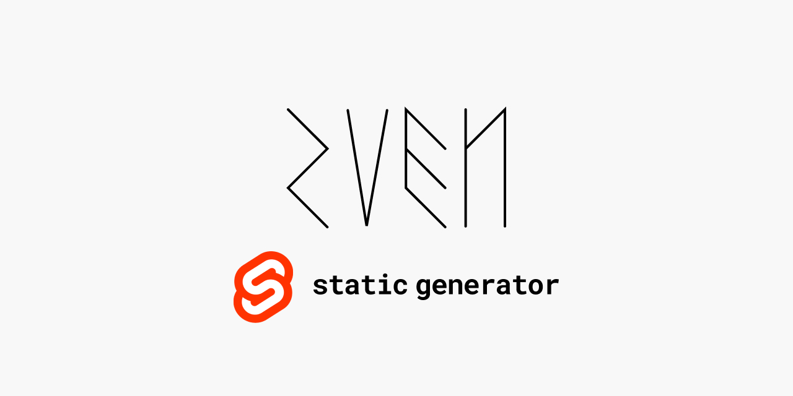

# sven

`sven` is a minimal static site generator for [svelte](https://svelte.dev/). It is a [rollup config](https://rollupjs.org/guide/en/#loading-a-configuration-from-a-node-package) module.

It implements a very small number of features. If you have a complex use-case, it may be better to evsluate one of these:

- [sapper](https://sapper.svelte.dev/)
- [elder](https://github.com/Elderjs/elderjs)

## Quickstart

Created a new `index.svelte` file in a `pages` directory:

```html
<main>Home</home>
```

`sven` requires both `svelte` and `rollup` as peer dependencies.

```bash
$ yarn add svelte rollup rollup-config-sven -D
```

After you've installed the dependencies, you can run the build with:

```bash
$ npx rollup -c node:sven" 
```

You should now have a `public` directory containing your static files!

